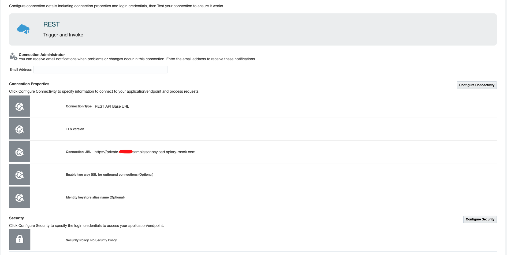

# Lab 304: Function calling an Apiary endpoint

## Intro

Because [lab 303](https://github.com/GaryHostt/OCI_DevOps/blob/master/Lab303.md) relies upon an external API you may not have time to configure, this lab will use an Apiary endpoint which is free and a little easier to setup. The code in the function will also show you how to create more generic REST payloads for functions. 

....
Begin by creating an application in the cloud console. 


 

 

```
fn init --runtime python submit-func
cd submit-func
```
replace the code in func.py with the submit.py code
change requirements.txt to
```
fdk
requests
```

```
fn -v deploy --app genericAPIcall
```

After deploying, return to the cloud console to create the function. 

 

 

## Apiary

 

 
## running it 

test from CLI:

```
fn invoke genericAPIcall submit-funcc
```

see apiary log

105

## behind APIg

# References 

### Apiary blueprint

```
FORMAT: 1A
HOST: https://polls.apiblueprint.org/

# Generic_API

API meant to receive payload from functions

FORMAT: 1A
HOST: https://polls.apiblueprint.org/

# PO_Creation

This is a simple API allowing the receiving of a payload from events.

## API Collection [/purchaseOrders]

### Post a payload [POST]

+ Request (application/json)

        {
            "Field1": "12345",
            "Field2": 1234,
            "Field3":"12345",
            "Field4":"email@email.com"
        }

+ Response 201 (application/json)

    + Headers

            Location: /PO/2

    + Body

            {"status":"success"}


```

### func.py 
```
import json
import requests
from requests.exceptions import HTTPError

def getPayload():
    data = {}
    data['Field1'] = 'value1'
    data['Field2'] = 55
    data['Field3'] = 'value3'
    data['Field4'] = 'value4'
    return data
# Generate each parameter's data input in varying proportions
def submitData(data):
    headers = {
        'Content-Type': "application/json",
        'Content-Transfer-Encoding': "buffered"
            }
    payload = data
    print(payload)  
    url='<APIARY ENDPOINT>'
    r = requests.request("POST", url, data=payload, headers=headers)
    print(r.status_code)
    response = requests.Session()
# Send payload to database API

data = json.dumps(getPayload())
submitData(data)


```


