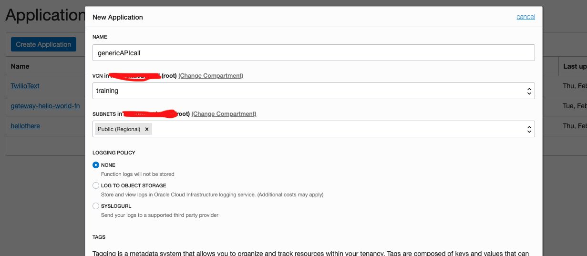
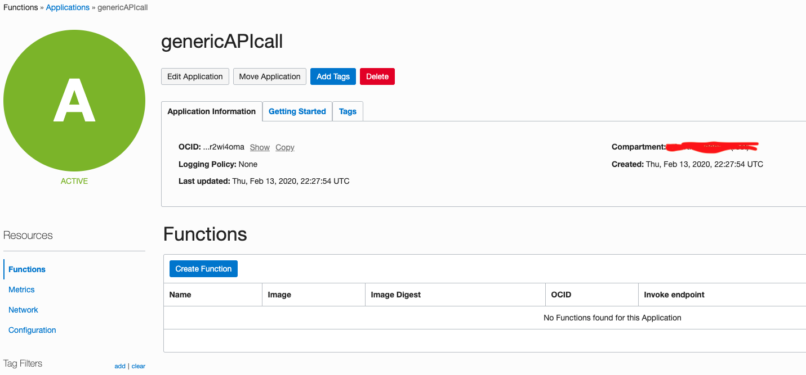
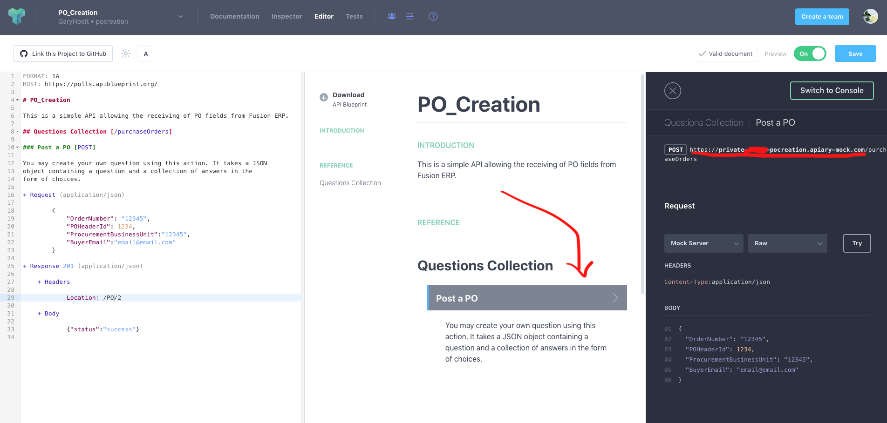
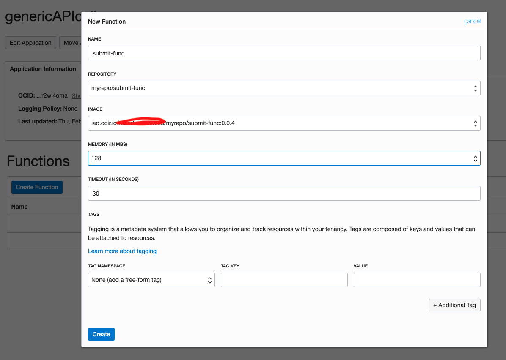
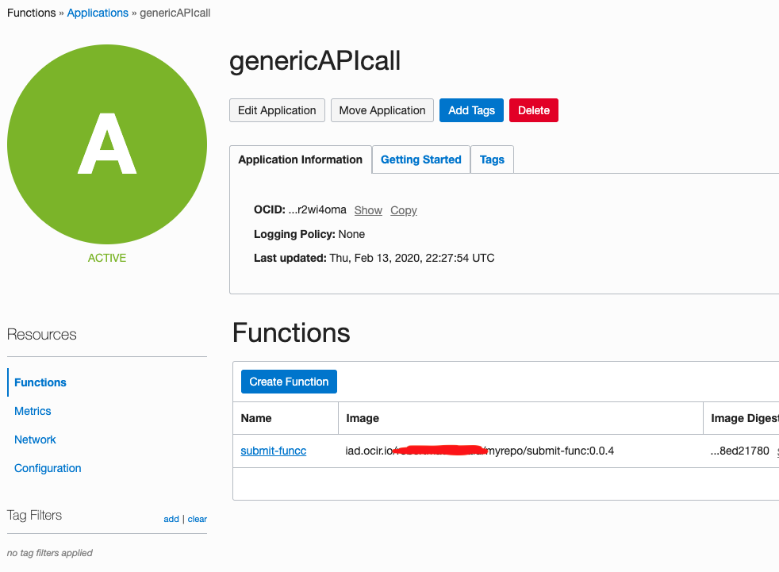
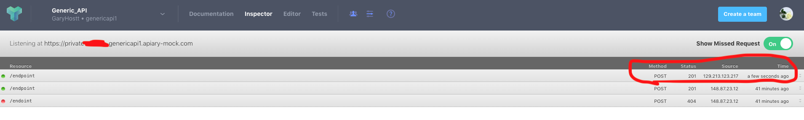

# Lab 304: Function calling an Apiary endpoint


 

## Intro

Because [lab 303](https://github.com/GaryHostt/OCI_DevOps/blob/master/Lab303.md) relies upon an external API you may not have time to configure, this lab will use an Apiary endpoint which is free and a little easier to setup. The code in the function will also show you how to create more generic REST payloads for functions. 

This lab requires you to have an [apiary account](https://apiary.io/). You should begin this lab by creating a new API project on apiary and then replacing the standard blueprint with my API blueprint at the bottom of this page.

## Workshop

Begin by creating an application in the cloud console. 

 

 

After creating your application, you can initialize your fn function.

```
fn init --runtime python submit-func
cd submit-func
```
Replace the code in func.py with the submit.py code. 

 

You can get your Apiary endpoint from this location, after copying the blue print at the bottom of this lab. 

Then update requirements.txt to:
```
fdk
requests
```
After doing that, you can deploy the function to your application.
```
fn -v deploy --app genericAPIcall
```
After deploying, return to the cloud console to create the function. 

 

Select the function uploaded to your repo.

 

You can now test the function from your CLI by running:

```
fn invoke genericAPIcall submit-funcc
```
The console may print, however the function may have still worked. 

```
Error invoking function. status: 502 message: function failed
```

## Apiary

Next, you can login to Apiary, go to the inspector tab and see the log for your API call.

 

We can see our endpoint successfully received the API call

## Behind API Gateway

Next we can [put the function behind the gateway & call it](https://github.com/GaryHostt/OCI_DevOps/blob/master/Lab303.md). 

# References 

## Apiary blueprint

```
FORMAT: 1A
HOST: https://polls.apiblueprint.org/

# Generic_API

API meant to receive payload from functions

FORMAT: 1A
HOST: https://polls.apiblueprint.org/

# PO_Creation

This is a simple API allowing the receiving of a payload from events.

## API Collection [/purchaseOrders]

### Post a payload [POST]

+ Request (application/json)

        {
            "Field1": "12345",
            "Field2": 1234,
            "Field3":"12345",
            "Field4":"email@email.com"
        }

+ Response 201 (application/json)

    + Headers

            Location: /PO/2

    + Body

            {"status":"success"}


```

## func.py 

You need to replace <APIARY ENDPOINT> with your own.
```
import json
import requests
from requests.exceptions import HTTPError

def getPayload():
    data = {}
    data['Field1'] = 'value1'
    data['Field2'] = 55
    data['Field3'] = 'value3'
    data['Field4'] = 'value4'
    return data
# Generate each parameter's data input in varying proportions
def submitData(data):
    headers = {
        'Content-Type': "application/json",
        'Content-Transfer-Encoding': "buffered"
            }
    payload = data
    print(payload)  
    url='<APIARY ENDPOINT>'
    r = requests.request("POST", url, data=payload, headers=headers)
    print(r.status_code)
    response = requests.Session()
# Send payload to database API

data = json.dumps(getPayload())
submitData(data)


```


