# Lab 100: Beginning with Events

 

This is the part of the architecture being completed in Lab 100.

## Create the notifications topic & subscription

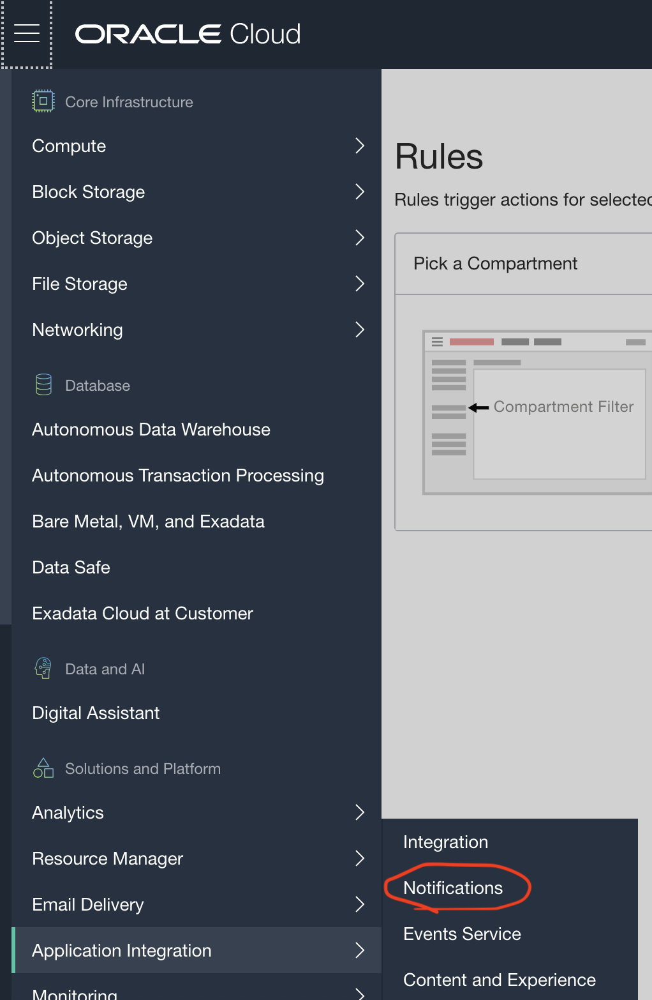

Begin by logging into your cloud account. From the cloud console, click the upper left menu button and proceed to Application Integration -> Notifications.

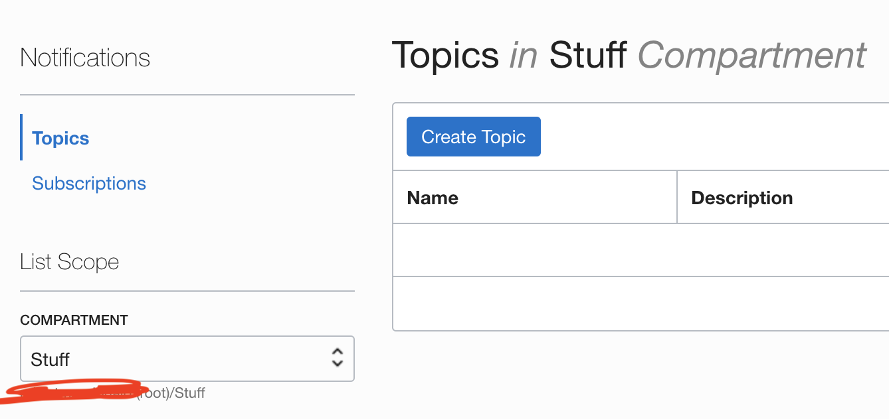 

Begin by creating a topic. 

 

Give your topic a name and description. Optionally, you can tag the topic - if this topic is only meant for one deparment within your company - your key might be 'department' and the value could be 'HR.'

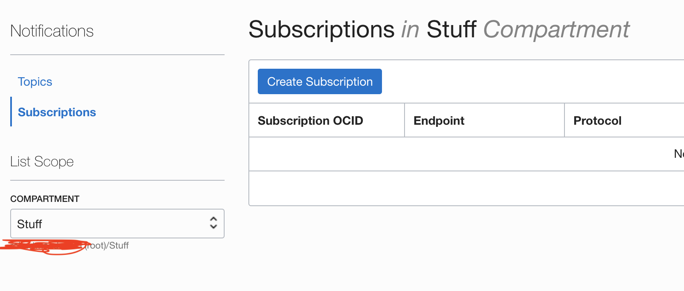 

After creating a topi you need to create a subscription, accessed from the same location on the menu. 

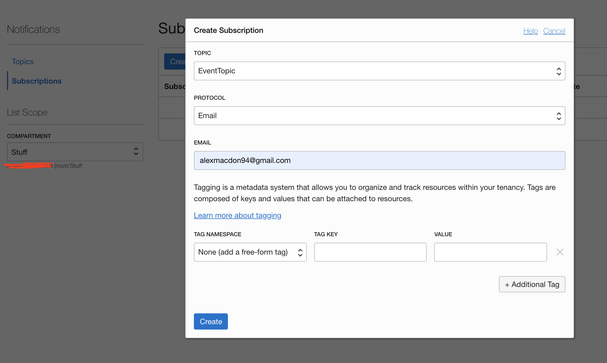 

For the protocol, select email and enter an email address you can access.

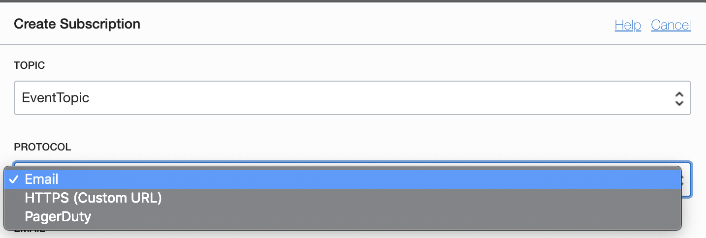 

You can also use HTTPS and PagerDuty. 

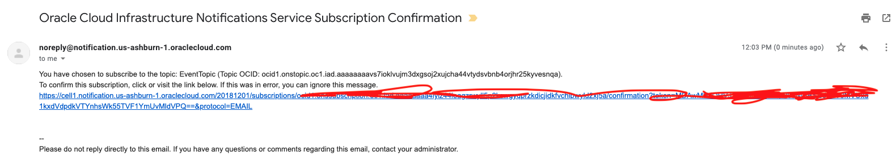 

Click the link in the confirmation email to activate the subscription.

## Create the event rule

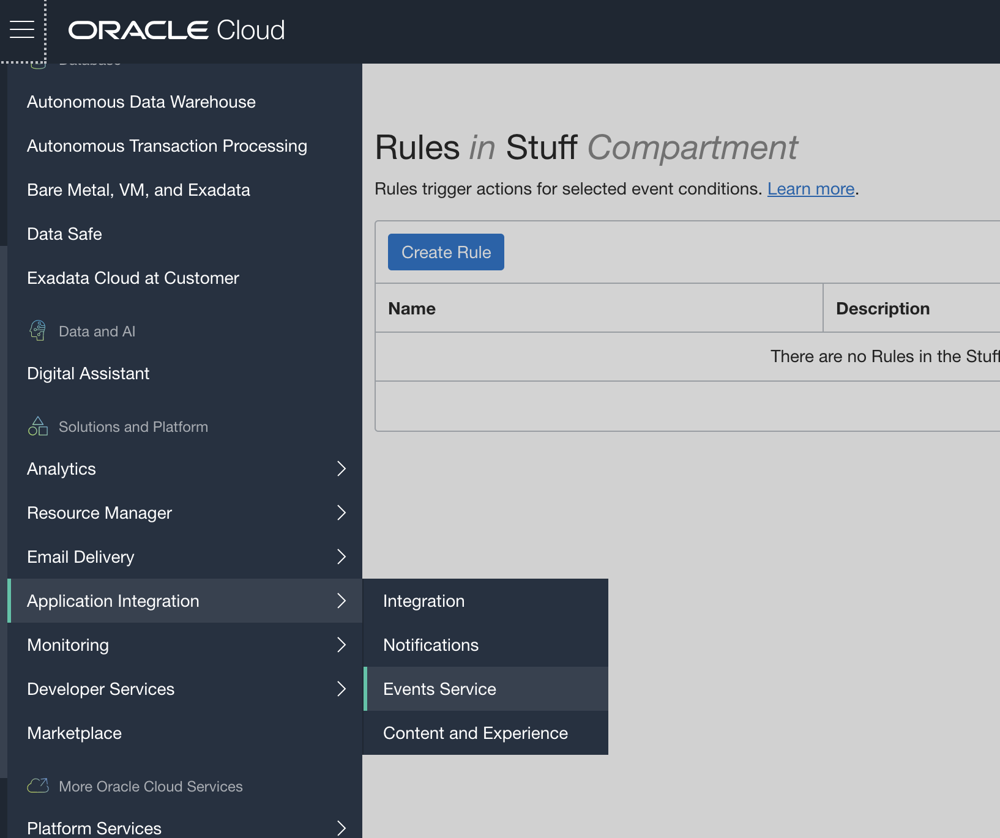 

From your cloud console, click the upper left menu -> application integration -> events service. 

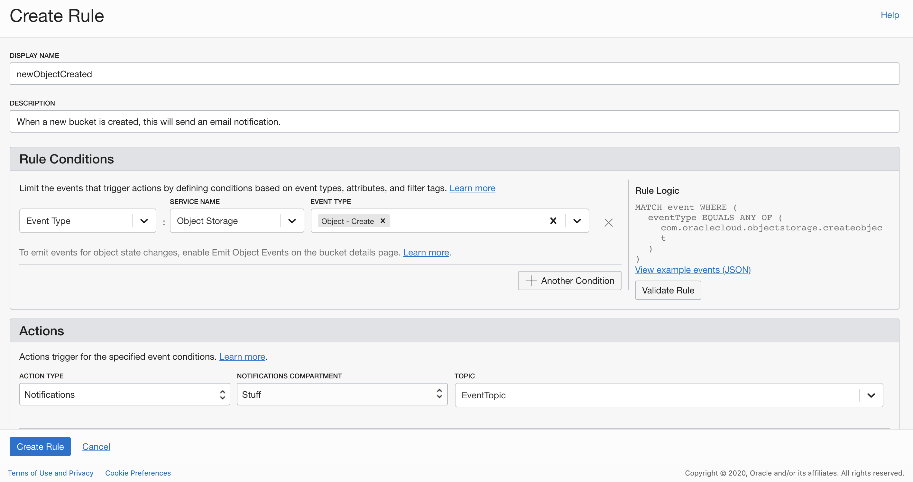 

For the rule, you can pick the service name you would like to listen to and then the various events associated with that service. In this case, I am listening for when an object is created in one of my object storage buckets. 

You will then select the action to be triggered when that rule occurs, in this case I am selecting the previously created notifiction 'EventTopic.'

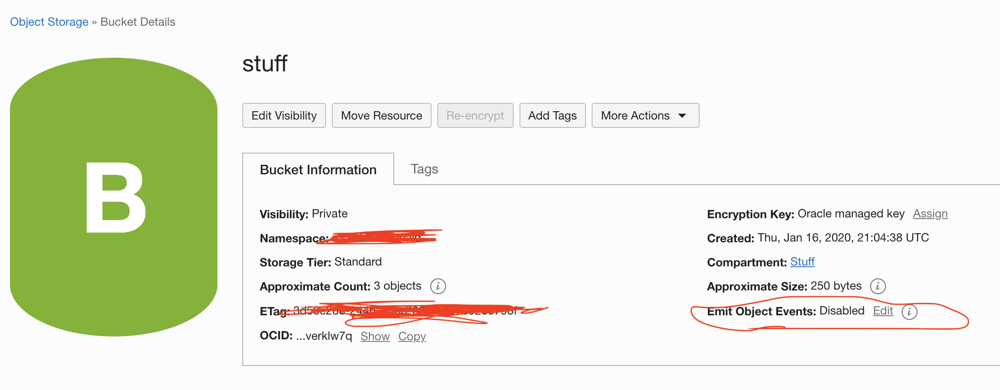 

Go to your object storage bucket and click the circled edit button. 

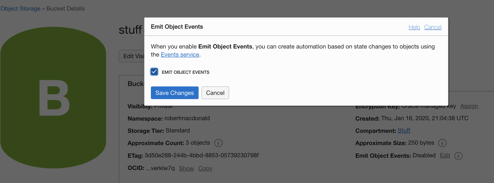 

Click the checkbox. 

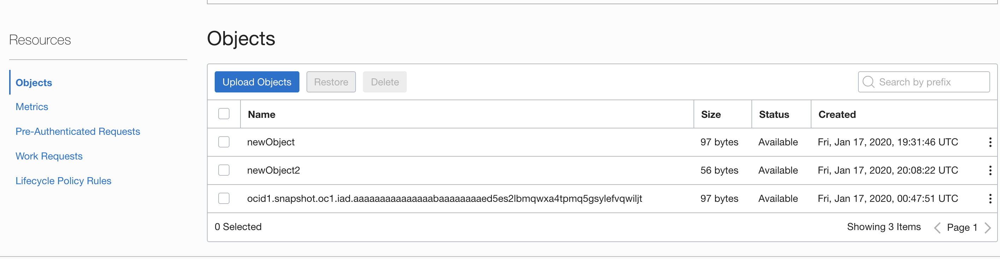 

You can upload an object from the console by pressing the 'upload object button'

 

You will then get a notification email like this. If you select HTTPS endpoint under notification instead of email, this JSON payload will be sent to that endpoint. 

Congratulations, you have finished Lab100! [Click here to go to Lab 200.](https://github.com/GaryHostt/OCI_DevOps/blob/master/Lab200.md)
