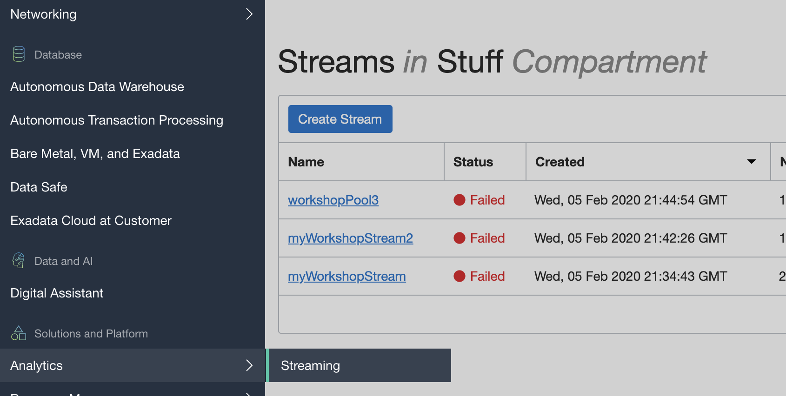
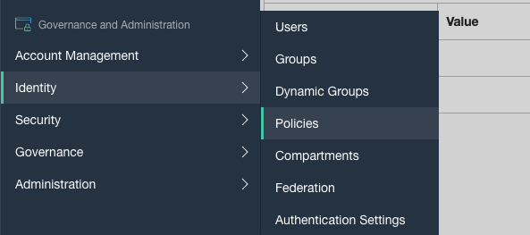
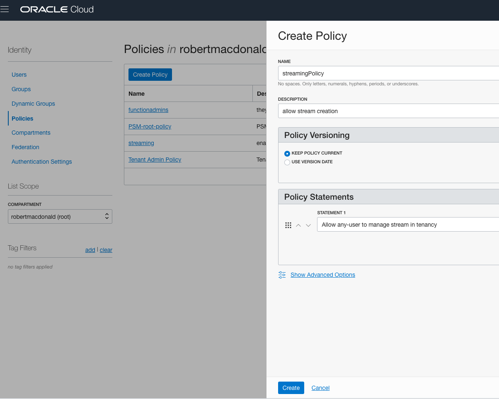
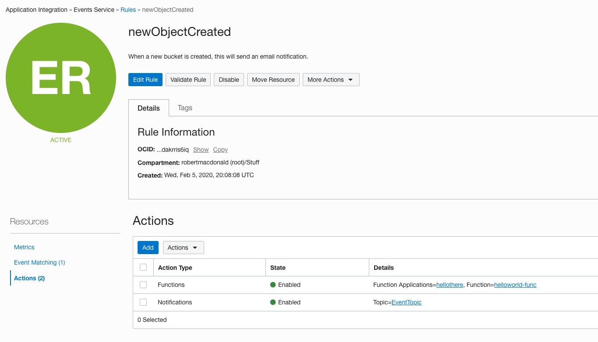
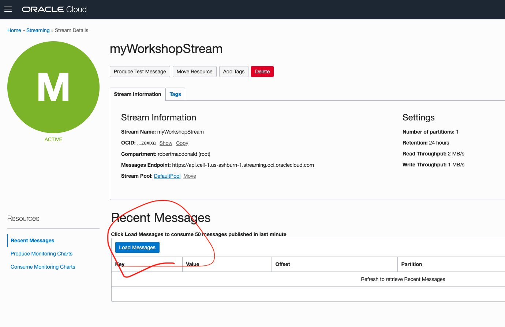
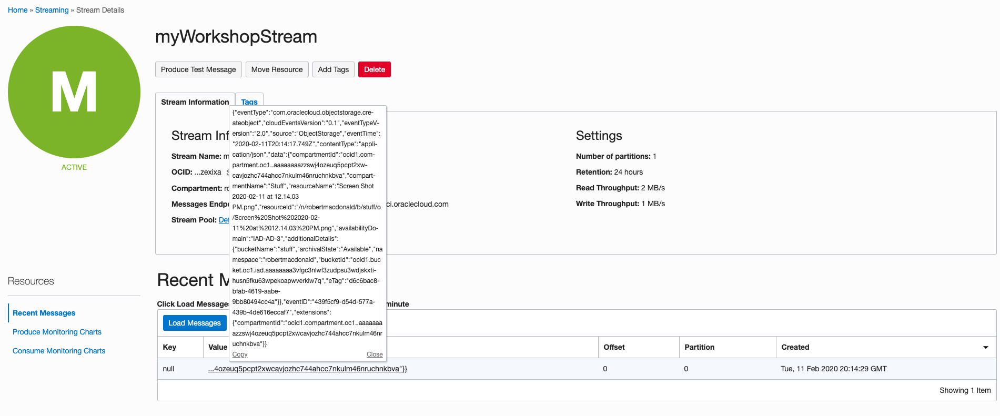

# Lab 200: Working with Streaming

[Overview of Events](https://docs.cloud.oracle.com/en-us/iaas/Content/Events/Concepts/eventsoverview.htm)
[Streaming Service Overview](https://docs.cloud.oracle.com/en-us/iaas/Content/Streaming/Concepts/streamingoverview.htm)

## Pre-requisites

[Configure your environment to receive API calls via Postman](https://www.ateam-oracle.com/invoking-oci-rest-apis-using-postman)


## Workshop

We will now be creating the streaming part of this architecture. 

[To begin, you will need the API endpoint of your desired region.](https://docs.cloud.oracle.com/en-us/iaas/api/#/en/streaming/20180418/)

To create the endpoint that you will call in Postman, take this API endpoint, then you will add the URI for creating a stream below. 

[We will be using the CreateStream API endpoint.](https://docs.cloud.oracle.com/en-us/iaas/api/#/en/streaming/20180418/Stream/CreateStream)

In the body on Postman, use this payload:

```
{
  "compartmentId": "ocid1.compartment.",
  "name": "myWorkshopStream",
  "partitions": "2"
}
```

To get your compartmentId, go to identity, compartments, click on your desired compartment for streaming, and copy the OCID from there.


You should get a response like such: 
```
{
  "name": "myWorkshopStream",
  "id": "ocid1.stream.oc1.xxxx",
  "partitions": 2,
  "retentionInHours": 24,
  "compartmentId": "ocid1.compartment.oc1.xxxxruchnkbva",
  "streamPoolId": "ocid1.streampool.oc1.iad.amaaaaaxxxx5jgb25a",
  "lifecycleState": "CREATING",
  "timeCreated": "2020-02-05T21:34:43.997Z",
  "messagesEndpoint": "https://api.cell-1.us-ashburn-1.streaming.oci.oraclecloud.com",
  "freeformTags": {},
  "definedTags": {}
}
```

You can also create a stream from the UI by clicking the left menu, under Solutions & Platform, Analytics, streaming, and clicking create. 

[You can also create your stream via the CLI](https://docs.cloud.oracle.com/en-us/iaas/tools/oci-cli/2.7.0/oci_cli_docs/cmdref/streaming/admin/stream/create.html)



If your stream fails to create like the above screenshot, then you must create a policy. 



Navigate to policies.



Input this policy [or a more restrictive one.](https://docs.cloud.oracle.com/en-us/iaas/Content/Identity/Concepts/policysyntax.htm)

After creating your stream, return to your previously created rule under Application Integration > Events Service > Rules.



Add an action, select streaming from the drop down and pick your created stream.

Now go upload another object to your bucket. 




Return to your stream and press load messages. 



Congratulations, you have loaded your OCI event message. You can continue using streaming by [creating a consumer.](https://docs.cloud.oracle.com/en-us/iaas/Content/Streaming/Tasks/consuming.htm)

[Or consume the messages via the REST API](https://docs.cloud.oracle.com/en-us/iaas/api/#/en/streaming/20180418/Message/GetMessages)


