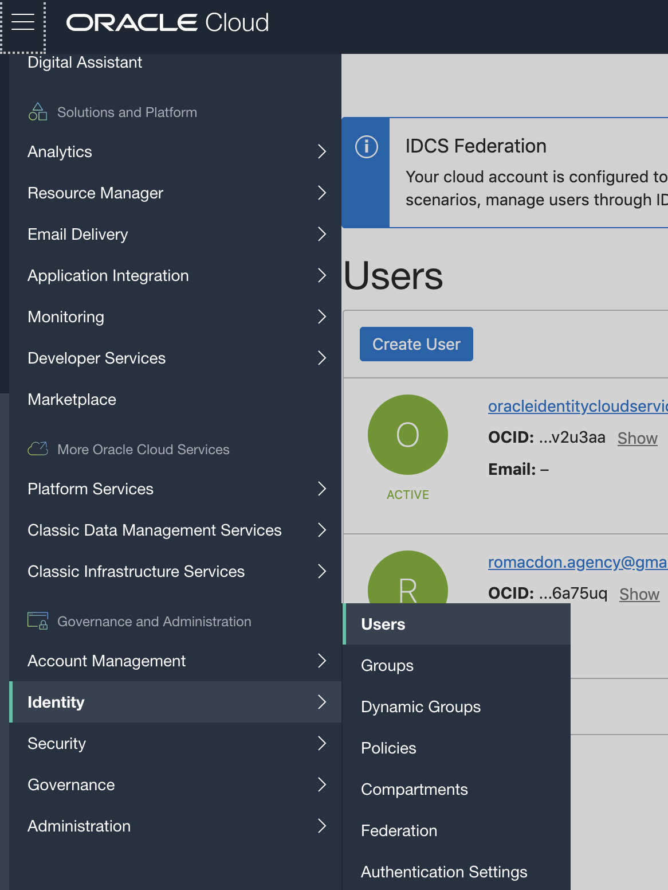
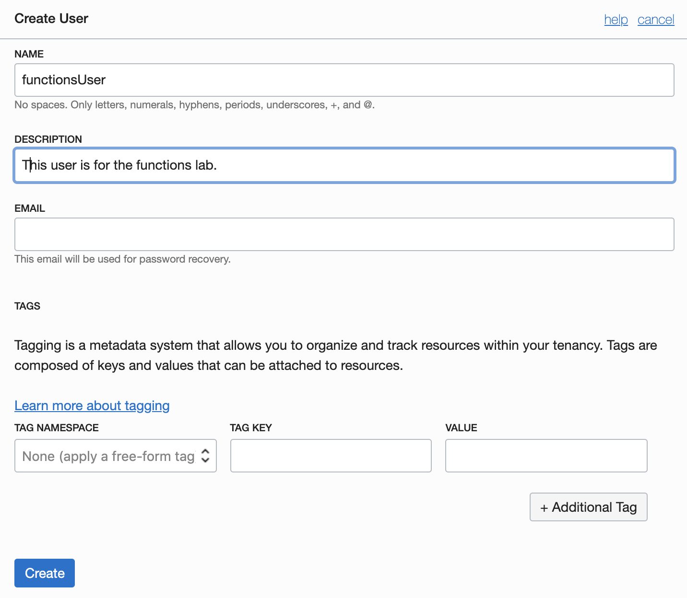
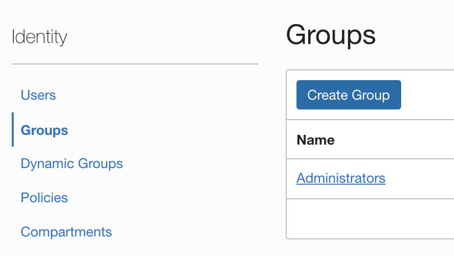
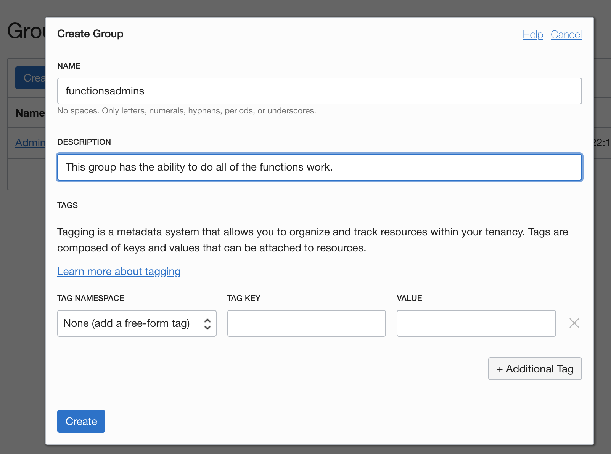
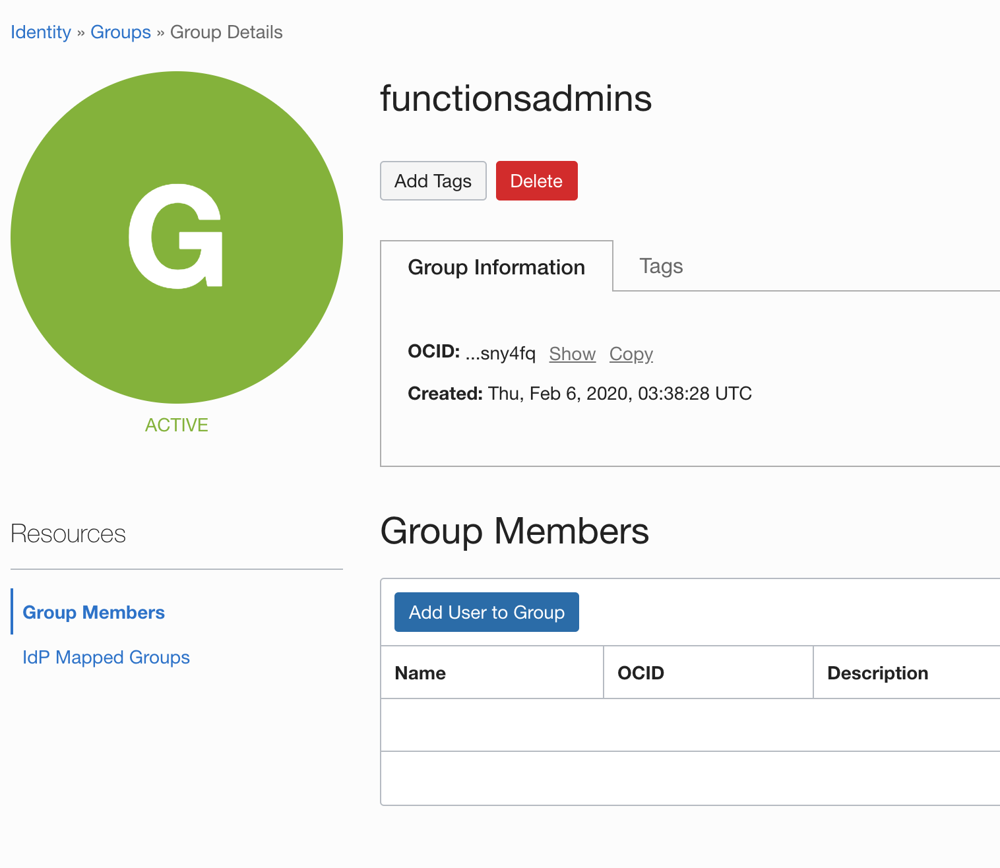
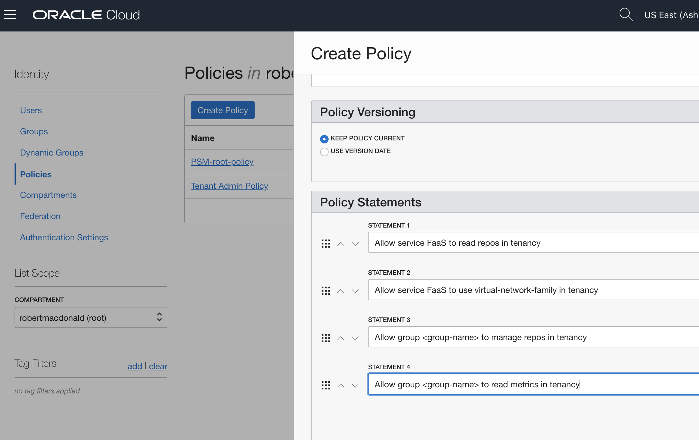
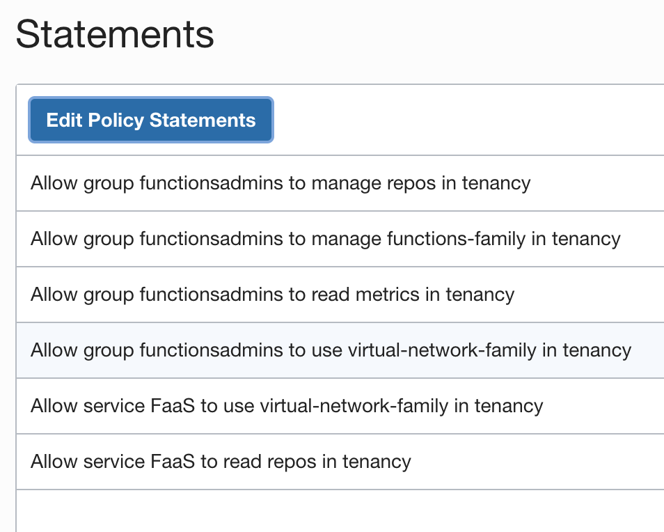
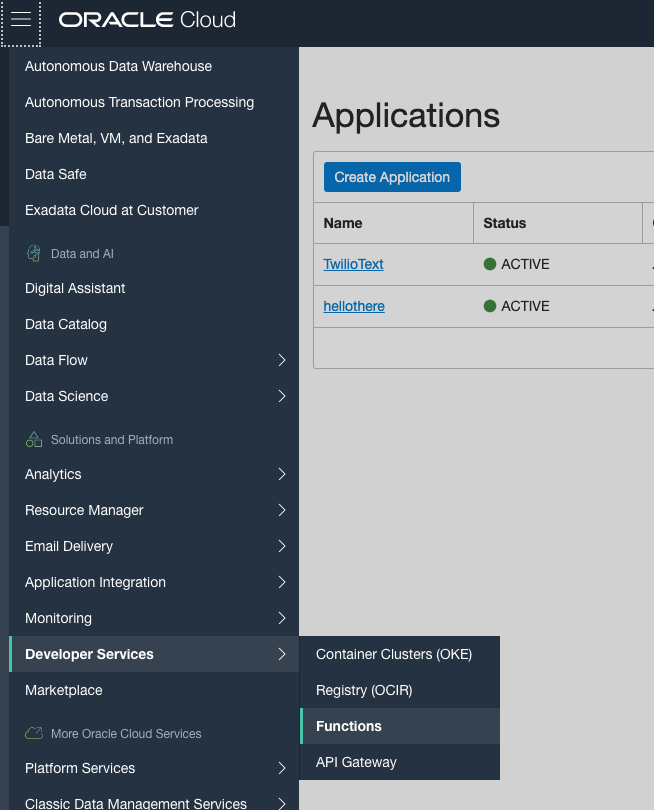
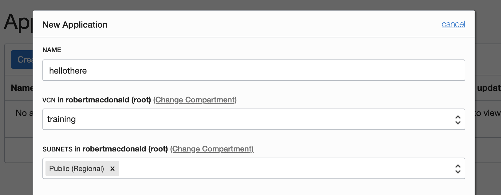

# Lab 300: Serverless Functions

<p align="center">
  
</p>

[Source](http://www.commitstrip.com/en/2017/04/26/servers-there-are-no-servers-here/)

## Recommended Resources to start with before this lab

[Getting started with functions lab - MANDATORY](https://www.oracle.com/webfolder/technetwork/tutorials/infographics/oci_faas_gettingstarted_quickview/functions_quickview_top/functions_quickview/index.html#localdevenv)
  There is also this [secondary lab](https://www.oracle.com/webfolder/technetwork/tutorials/infographics/oci_faas_gettingstarted_quickview/functions_quickview_top/functions_quickview/index_text.html)

You may consider the above lab as the best place to start using functions while the rest of this page is a repo for supplemental knowledge. In [lab 301](https://github.com/GaryHostt/OCI_DevOps/blob/master/Lab301.md) and [lab 302](https://github.com/GaryHostt/OCI_DevOps/blob/master/Lab302.md), we will build on the work from that lab. The bottom of this page in this repo has consolidated the terminal commands you will use in the above lab. 

## Useful resources

[fn project tuturials](https://fnproject.io/tutorials/)

[fn project documentation](https://github.com/fnproject/docs)

[Functions API](https://docs.cloud.oracle.com/en-us/iaas/api/#/en/functions/20181201/)

[Functions CLI](https://docs.cloud.oracle.com/en-us/iaas/Content/Functions/Tasks/functionsusingwithfncli.htm)

[CI/CD for Functions](https://blogs.oracle.com/developers/cicd-automation-for-project-fn-with-oracle-faas-and-developer-cloud-service)

[3 letter OCI region codes](https://docs.cloud.oracle.com/en-us/iaas/Content/General/Concepts/regions.htm) (useful for terminal commands in first lab)

[Chapter 10 of this manual is useful for the registry](https://docs.cloud.oracle.com/en-us/iaas/pdf/ug/OCI_User_Guide.pdf)

[Preparing your container registry](https://docs.cloud.oracle.com/en-us/iaas/Content/Registry/Concepts/registryprerequisites.htm#regional-availability)

[Dockerizing your Python Application](https://runnable.com/docker/python/dockerize-your-python-application)

[Deploying docker image to project fn](https://fnproject.io/tutorials/ContainerAsFunction/)

## Pre-requisite work

**Note:** this lab will assume you have properly configured the project fn CLI on your machine



Begin by creating a new user.





Then create a group. 




Add your created user to the functions group.



Create a policy for your group to enable function access. **Note, you should probably be more secure than enabling tenancy wide access, but for speed - there is this option.**



These are the policies you will need, click here to read more about [IAM policies for functions.](https://docs.cloud.oracle.com/en-us/iaas/Content/Functions/Tasks/functionscreatingpolicies.htm#ocir-policy)

Navigate to developer services > functions, and create a new app. 


## Useful command line commands for reference

These are performed in order and will setup your terminal to have fn and be connect to your cloud's container repository.
```
docker login iad.ocir.io
<TENANCY>/<USERNAME>
<TOKEN>

brew install fn
fn version
fn create context ocicontext1 --provider oracle
fn use context ocicontext1
fn update context oracle.profile functionsUser
fn update context oracle.compartment-id ocid1.tenancy.oc1..aaabkakkackakdnum3fd24qioebxwe3xuqdealrsa2g42gs4ja
fn update context api-url https://functions.us-ashburn-1.oci.oraclecloud.com
fn update context registry iad.ocir.io/<TENANCYNAME>/myrepo

fn init --runtime java helloworld-func
cd helloworld-func
fn -v deploy --app hellothere

fn invoke hellothere helloworld-func
```
## Extending functions

[Deploying your hello-world function to API Gateway](https://blogs.oracle.com/developers/creating-your-first-api-gateway-in-the-oracle-cloud)

[Querying an ATP database with Functions](https://blogs.oracle.com/developers/oracle-functions-connecting-to-an-atp-database-revisited)

### More information

[Add functions user to the oci config file](https://docs.cloud.oracle.com/en-us/iaas/Content/Functions/Tasks/functionssetupapikey.htm)

### Going forward

[Functions with API Gateway](https://docs.cloud.oracle.com/en-us/iaas/Content/APIGateway/Tasks/apigatewayusingfunctionsbackend.htm)

[Managing APIs with terraform!](https://blogs.oracle.com/cloud-infrastructure/using-terraform-to-manage-your-apis)

[Deploying a flask api on API Gateway](https://github.com/stretchcloud/OCI-APIGW-Demo-API)


