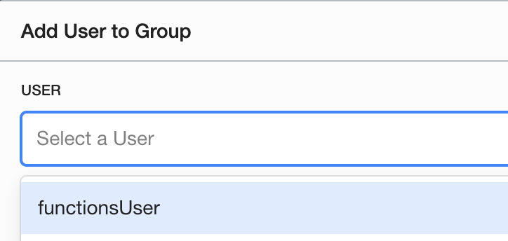

# Lab 300: Serverless Functions

## Recommended Resources to start with before this lab

Note: this lab will assume you have properly configured the project fn CLI on your machine

[Getting started with functions - lab](https://www.oracle.com/webfolder/technetwork/tutorials/infographics/oci_faas_gettingstarted_quickview/functions_quickview_top/functions_quickview/index.html#localdevenv)

[Secondary lab](https://www.oracle.com/webfolder/technetwork/tutorials/infographics/oci_faas_gettingstarted_quickview/functions_quickview_top/functions_quickview/index_text.html)

## Useful resources for this lab

[3 letter region codes](https://docs.cloud.oracle.com/en-us/iaas/Content/General/Concepts/regions.htm)

[Chapter 10 of this manual is useful for the registry](https://docs.cloud.oracle.com/en-us/iaas/pdf/ug/OCI_User_Guide.pdf)

[Preparing your registry](https://docs.cloud.oracle.com/en-us/iaas/Content/Registry/Concepts/registryprerequisites.htm#regional-availability)

[Functions API](https://docs.cloud.oracle.com/en-us/iaas/api/#/en/functions/20181201/)

[Functions CLI](https://docs.cloud.oracle.com/en-us/iaas/Content/Functions/Tasks/functionsusingwithfncli.htm)

[fn project tuturials](https://fnproject.io/tutorials/)

[fn project documentation](https://github.com/fnproject/docs)

[Dockerizing your Python Application](https://runnable.com/docker/python/dockerize-your-python-application)

[Deploying docker image to project fn](https://fnproject.io/tutorials/ContainerAsFunction/)

## Pre-requisite work

Begin by creating a new user.

Then create a group. 

Add your created user to the functions group.

Create a policy for your group to enable function access. 

These are the policies you will need, click here to read more about [IAM policies for functions.](https://docs.cloud.oracle.com/en-us/iaas/Content/Functions/Tasks/functionscreatingpolicies.htm#ocir-policy)

Navigate to developer services > functions, and create a new app. 

## Extending functions

[Deploying your hello-world function to API Gateway](https://blogs.oracle.com/developers/creating-your-first-api-gateway-in-the-oracle-cloud)

[Querying an ATP database with Functions](https://blogs.oracle.com/developers/oracle-functions-connecting-to-an-atp-database-revisited)

Continue to Lab 400 to see this two workshops merged.

### More information

[Add functions user to the oci config file](https://docs.cloud.oracle.com/en-us/iaas/Content/Functions/Tasks/functionssetupapikey.htm)

### Going forward

[Functions with API Gateway](https://docs.cloud.oracle.com/en-us/iaas/Content/APIGateway/Tasks/apigatewayusingfunctionsbackend.htm)

[Managing with terraform!](https://blogs.oracle.com/cloud-infrastructure/using-terraform-to-manage-your-apis)

[Deploying a flask api on API Gateway](https://github.com/stretchcloud/OCI-APIGW-Demo-API)

