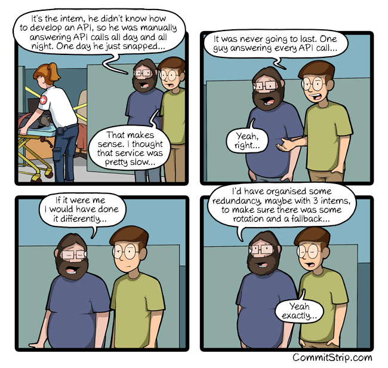
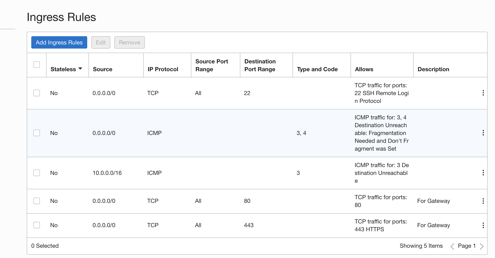
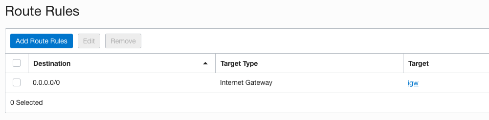
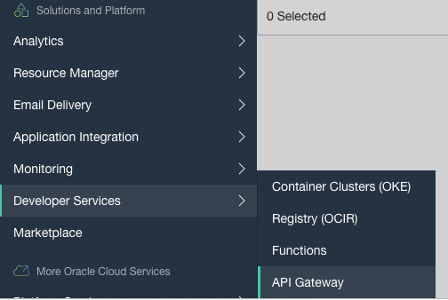
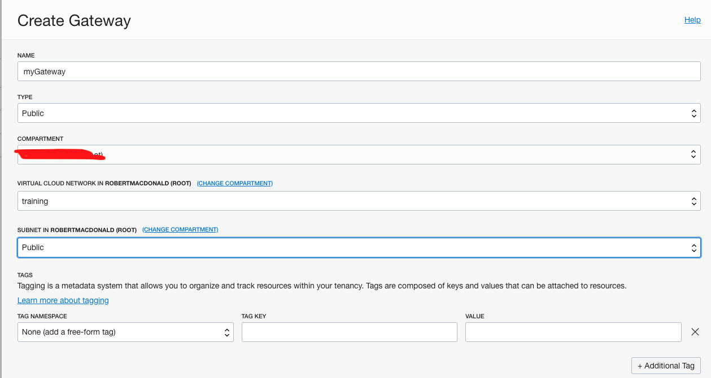
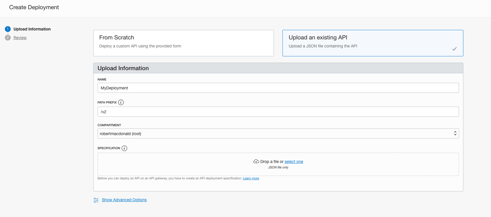
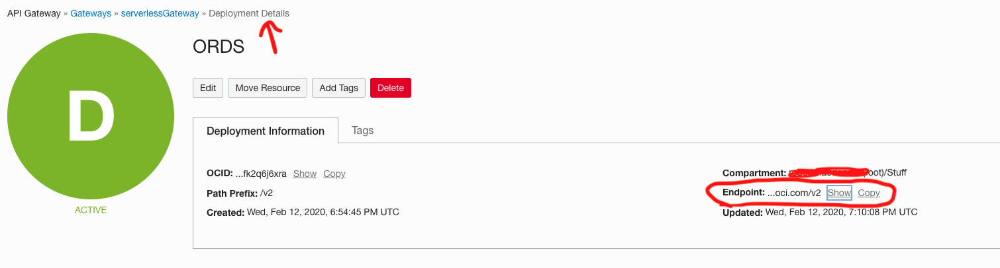
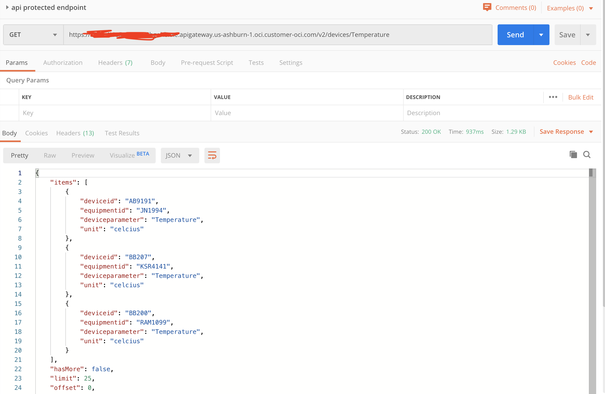

# Lab 301: Using API Gateway with an already existing API

 

## Introduction

In this lab I will be putting my ORDS endpoint [from my previous lab](https://github.com/GaryHostt/sampeIoTData) behind an API Gateway because I would like to apply a rate-limiting policy. 

[Deploying a flask api on API Gateway](https://github.com/stretchcloud/OCI-APIGW-Demo-API)

## Pre-requisites

You have an already existing API endpoint, preferably no auth required, and it's an ORDS endpoint. 

 

This assumes you have placed your Gateway in a subnet with ingress rules allowing ports 80 and 443.

Your VCN must have an IG and a route open to it. 

 

## Workshop


 

Navigate to the API Gateway from the left console. 


 

When creating the gateway, put it in a public subnet. 

Once your gateway is green & active, click create deployment. 


 

Name your deployment and give it a path prefix for your endpoint later, I used '/v2' in my case, because this is my newer API version. 

For the JSON file you'll upload, create a .json file similar to mine below: 

```
{
  "requestPolicies": {},
  "routes": [
    {
      "path": "/devices/Temperature",
      "methods": ["GET"],
      "backend": {
        "type": "HTTP_BACKEND",
        "url": "<ORDS BASE URL>apexuser/devices/Temperature"
      },
      "requestPolicies": {}
    }
  ]
}
```

[Click here to see where to get your ORDS base url](https://github.com/GaryHostt/sampeIoTData)

Once your deployment state is active, click on it. 


 

Copy the endpoint url, it should be something like: 

```

https://abc1234.apigateway.us-ashburn-1.oci.customer-oci.com/v2

```
However, you will need to truncate the path from your JSON file to the end, in my case the full endpoint with the URI is:

```
https://abc1234.apigateway.us-ashburn-1.oci.customer-oci.com/v2/devices/Temperature
```

Now you can take this URL and put it in Postman. 


 

Congrats, your ORDS endpoint is now protected behind the API Gateway, but we still need to apply the rate limiting policy. 

This JSON shows the syntax to limit API calls to this endpoint to 1 per second, edit your JSON file. 

```
{
  "requestPolicies": {    
    "rateLimiting": {
      "rateKey": "TOTAL",
      "rateInRequestsPerSecond": 1
      }
    },
  "routes": [
    {
      "path": "/devices/Temperature",
      "methods": ["GET"],
      "backend": {
        "type": "HTTP_BACKEND",
        "url": "<ORDS BASE URL>apexuser/devices/Temperature"
      },
      "requestPolicies": {}
    }
  ]
}
```

Edit your deployment and upload your updated JSON file. 

Now simultaneously have a friend try to hit the endpoint with Postman and you should get a rate limit exceeded message, like below. 

```
{
    "message": "Too Many Requests",
    "code": 429
}
```

Next, we are going to add another ORDS endpoint. Edit your JSON like so to have a second path. 

```
{
  "requestPolicies": {    
    "rateLimiting": {
      "rateKey": "CLIENT_IP",
      "rateInRequestsPerSecond": 1
      }
    },
  "routes": [
    {
      "path": "/devices/Temperature",
      "methods": ["GET"],
      "backend": {
        "type": "HTTP_BACKEND",
        "url": "<ORDS BASE URL>apexuser/devices/Temperature"
      },
      "requestPolicies": {}
    },
    {
      "path": "/deviceTimes/times",
      "methods": ["DELETE"],
      "backend": {
        "type": "HTTP_BACKEND",
        "url": "<ORDS BASE URL>apexuser/deviceTimes/times"
      },
      "requestPolicies": {}
    }    
  ]
}
```
Since my delete endpoint is wiping the table, it would be wise to [add an authentication scheme](https://docs.cloud.oracle.com/en-us/iaas/Content/APIGateway/Tasks/apigatewayaddingauthzauthn.htm) to prevent malicious users from deleting my table. 

I changed the rateKey for the rateLimited request policy to "CLIENT_IP" to allow multiple users to hit the endpoint, if they do so simulataneously. This still prevents overwhelming the API, while enabling access to multiple users. 

An alternative to the architecture of this lab would be [directly invoking the ATP database](https://blogs.oracle.com/developers/oracle-functions-connecting-to-an-atp-database-revisited), instead of calling an ORDS endpoint. This can be done with API Gateway + serverless functions. 

Proceed to my [next lab to see how you can call a serverless function](https://github.com/GaryHostt/OCI_DevOps/blob/master/Lab302.md) via API Gateway.


