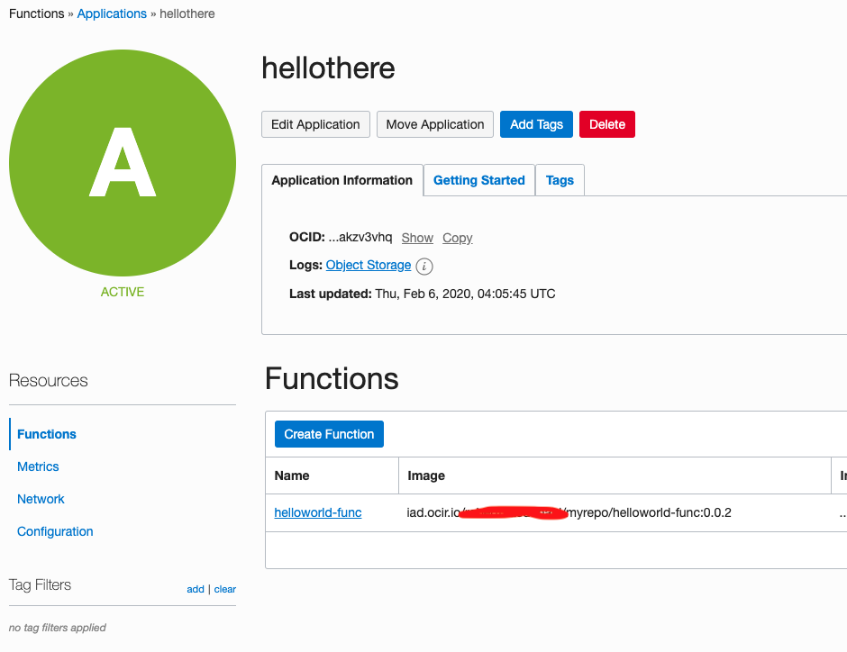
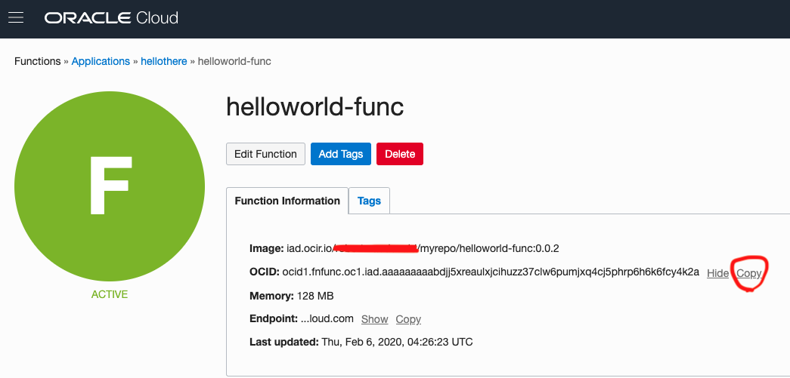
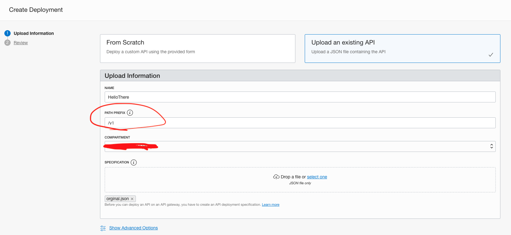
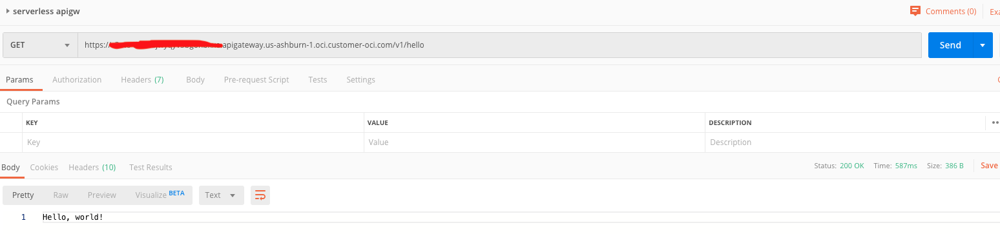

# Lab 302: Calling a function from API Gateway

 

## Introduction

[You can invoke Oracle functions 2 million times per month for free!](https://www.oracle.com/cloud/cloud-native/functions/)

If you did the basic hello-world lab listed in the pre-reqs of [my previous lab.](https://github.com/GaryHostt/OCI_DevOps/blob/master/Lab300a.md) We will now be calling the same function via API Gateway.

[For more details on functions with API Gateway](https://docs.cloud.oracle.com/en-us/iaas/Content/APIGateway/Tasks/apigatewayusingfunctionsbackend.htm)

## Pre-requisites

[You have completed this lab and have a working 'hello world' function.](https://www.oracle.com/webfolder/technetwork/tutorials/infographics/oci_faas_gettingstarted_quickview/functions_quickview_top/functions_quickview/index.html#localdevenv)

You have already deployed an API Gateway.

## Workshop

 

Go to your deployed application.
 
Now go to your helloworld function and copy the OCID.

I am able to invoke my function by typing:
```
fn invoke hellothere helloworld-func
```

Now go to your API Gateway and create a new deployment.

 

Upload a JSON file you create, similar to below. Your functionId should be the one you copied earlier.

```
{
  "requestPolicies": {},
  "routes": [
    {
      "path": "/hello",
      "methods": ["GET"],
      "backend": {
        "type": "ORACLE_FUNCTIONS_BACKEND",
        "functionId": "ocid1.fnfunc.oc1.iad.akdkads;kldsjklz37clw6pumja;lkjd;lkja4k2a"
      },
      "requestPolicies": {}
    }
  ]
}
```
After your deployment is created, copy the endpoing like in the last lab, and add /hello. Put this endpoint in Postman.

 

Congratulations, you have just invoked a serverless function via the API Gateway!


