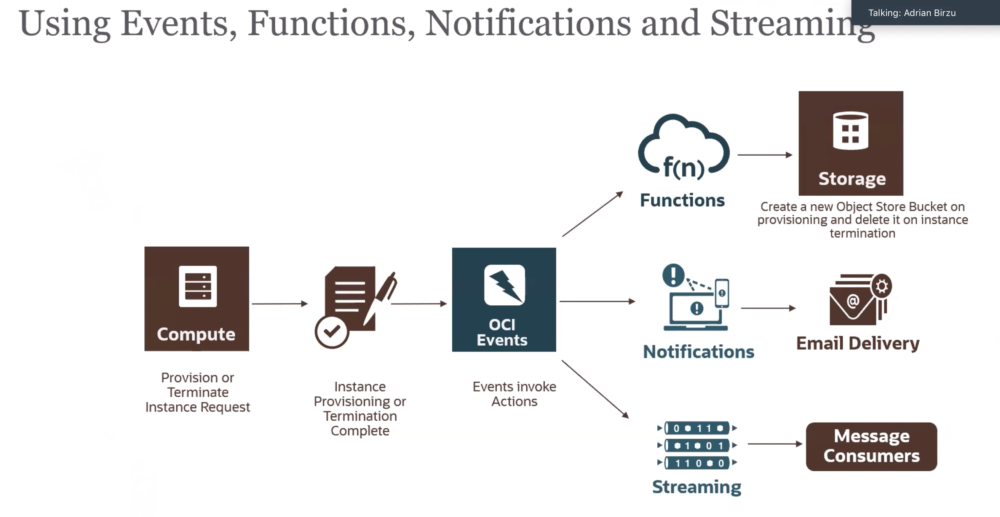

# Workshop: DevOps with OCI - Events, Functions, Notifications, and Streaming

## Introduction

This wokshop will show you how to use various OCI developer services such as OCI Events, Oracle's serverless functions, notifications, and streaming.

Event based serverless architecture is a popular paradigm in today's tech landscape and this workshop will show you how to use OCI with it.

## Useful links:
[About OCI Events](https://docs.cloud.oracle.com/en-us/iaas/Content/Events/Concepts/eventsoverview.htm)

[Getting started with Events](https://docs.cloud.oracle.com/en-us/iaas/Content/Events/Concepts/eventsgetstarted.htm)

[Notifications](https://docs.cloud.oracle.com/en-us/iaas/Content/Notification/Concepts/notificationoverview.htm)

[API Gateway](https://www.oracle.com/cloud/cloud-native/api-gateway/)

[How to create a ssh key](https://www.oracle.com/webfolder/technetwork/tutorials/obe/cloud/javaservice/JCS/JCS_SSH/create_sshkey.html)

[Oracle Functions](https://www.youtube.com/watch?v=ZJKviWdo-Ec)

This is the architecture you will have created after completing this workshop.

## Outline:
[Lab 100: Create Email Notification Topic, Subscription, and Event Rule](https://github.com/GaryHostt/OCI_DevOps/blob/master/Lab100.md)

[Lab 200: Working with Streaming](https://github.com/GaryHostt/OCI_DevOps/blob/master/Lab200.md)

[Lab 300: Getting started with functions](https://github.com/GaryHostt/OCI_DevOps/blob/master/Lab300a.md)

[Lab 301: Getting started with API Gateway](https://github.com/GaryHostt/OCI_DevOps/blob/master/Lab301.md)

# Pre-requisites

### 1. [Get an Oracle Cloud account](https://www.oracle.com/cloud/free/)
### 2. The user you are doing this with must have proper IAM permissions 
### 3. [Install the Oracle CLI](https://docs.cloud.oracle.com/en-us/iaas/Content/API/SDKDocs/cliinstall.htm)

[Click here to begin with Lab 100](https://github.com/GaryHostt/OCI_DevOps/blob/master/Lab100.md)

