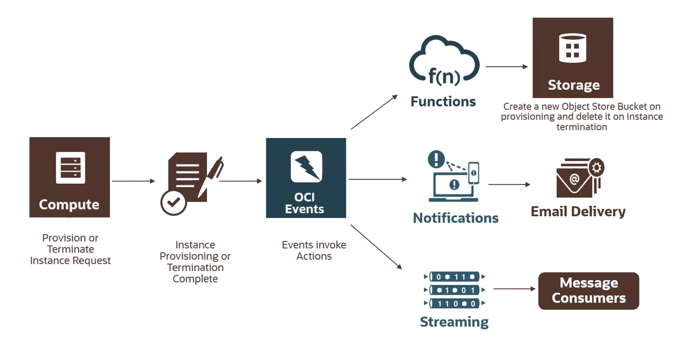

# Workshop: DevOps on OCI - Functions & API Gateway with Events, Notifications, Streaming, and more!

## Introduction

This wokshop will show you how to use various OCI developer services such as OCI Events, Oracle's serverless functions, notifications, and streaming. You will be able to create the above architecture upon completion & more.

Event based serverless architecture is a popular paradigm in today's tech landscape and this workshop will show you how to use OCI with it.

All being equal, [this workshop](https://code-innovate.github.io/spw-mono-to-micro/lab-guides/slow-track/?lab=workshop-introduction) goes much more in depth with the subjects below - consult it as well to learn DevOps on OCI!

## Outline
[Lab 100: Create Email Notification Topic, Subscription, and Event Rule](https://github.com/GaryHostt/OCI_DevOps/blob/master/Lab100.md)

[Lab 200: Working with Streaming](https://github.com/GaryHostt/OCI_DevOps/blob/master/Lab200.md)

[Lab 300: Getting started with functions](https://github.com/GaryHostt/OCI_DevOps/blob/master/Lab300a.md)

[Lab 301: Getting started with API Gateway](https://github.com/GaryHostt/OCI_DevOps/blob/master/Lab301.md)

[Lab 302: Calling a function via API Gateway](https://github.com/GaryHostt/OCI_DevOps/blob/master/Lab302.md)

[Lab 303: Performing an API call with a function via API Gateway](https://github.com/GaryHostt/OCI_DevOps/blob/master/Lab303.md)

[Lab 304: Calling an Apiary endpoint](https://github.com/GaryHostt/OCI_DevOps/blob/master/304.md) (alternative to 303, more general way to format API calls)

[Lab 400: Getting started with Kubernetes on OCI](https://github.com/GaryHostt/OCI_DevOps/blob/master/Lab400.md)

[Lab 500: My News gathering app running on OCI](https://github.com/GaryHostt/OCI_Native_NewsApp) featuring Flask API dockerization, Health checks, Alarms, OCI CLI, and Data Catalog

Coming soon: Ansible on OCI, CI/CD, and more!

# Pre-requisites

1. [Get an Oracle Cloud account](https://www.oracle.com/cloud/free/)
2. The user you are doing this with must have proper IAM permissions 
3. [Install the Oracle CLI](https://docs.cloud.oracle.com/en-us/iaas/Content/API/SDKDocs/cliinstall.htm)

[**Click here to begin with Lab 100**](https://github.com/GaryHostt/OCI_DevOps/blob/master/Lab100.md)

## Useful links:

[Oracle learning library on Github](https://github.com/oracle/learning-library) - learn how to do *everything* on OCI

[Oracle Integration Cloud](https://garyhostt.github.io/Oracle_Integration/)

[Oracle Data Integrator](https://github.com/GaryHostt/Oracle_Data_Integrator)

[OCI Events Documenation](https://docs.cloud.oracle.com/en-us/iaas/Content/Events/Concepts/eventsoverview.htm)

[OCI Notifications Documenation](https://docs.cloud.oracle.com/en-us/iaas/Content/Notification/Concepts/notificationoverview.htm)

[Video about Oracle Functions](https://www.youtube.com/watch?v=ZJKviWdo-Ec)

[Getting started with the OCI CLI](https://oracle.github.io/learning-library/oci-library/DevOps/OCI_CLI/OCI_CLI_HOL.html)

[API Gateway information](https://www.oracle.com/cloud/cloud-native/api-gateway/)

[How to create a ssh key for OCI on Mac & Windows](https://www.oracle.com/webfolder/technetwork/tutorials/obe/cloud/javaservice/JCS/JCS_SSH/create_sshkey.html)

[OCI Architecture Center](https://blogs.oracle.com/cloud-infrastructure/announcing-the-oracle-cloud-infrastructure-architecture-center)

[Build an APEX app in 30 minutes!](https://github.com/fatih-keles/30-min-workshops)

